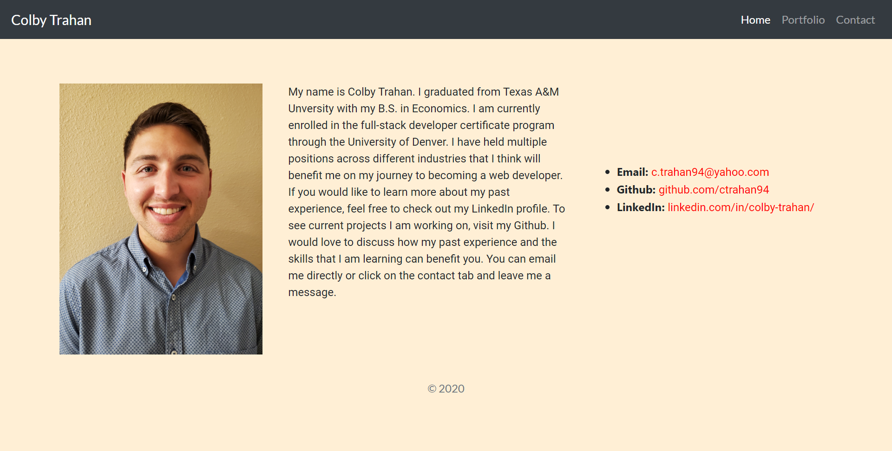
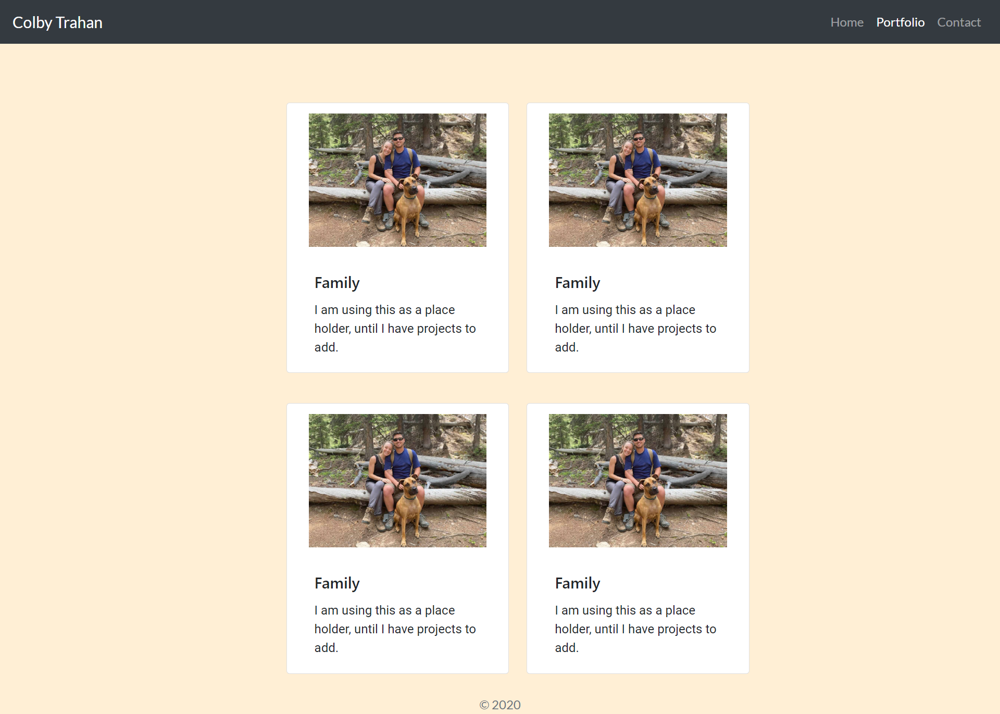
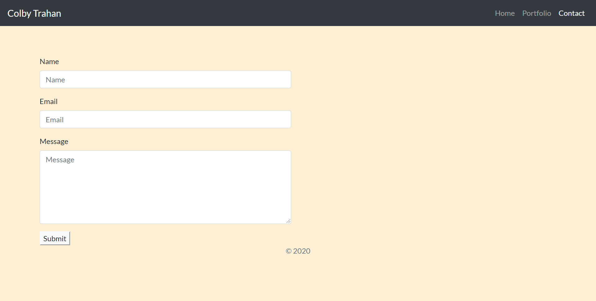

# homework02_responsiveness_portfolio

Link to site: [https://ctrahan94.github.io/homework2_responsive_portfolio/](https://ctrahan94.github.io/homework2_responsive_portfolio/)

link to repo: [https://github.com/ctrahan94/homework2_responsive_portfolio](https://github.com/ctrahan94/homework2_responsive_portfolio) 

## The Objective

To create a responsive portfolio that will render well on different size devices, windows and screens.

## The Motive
To create a portfolio that, as we progress through the class, we can add homeworks, assignments and projects to that showcase our abilities for potential employers. 

## The Solution
I used HTML, CSS and Bootstrap to create the portfolio. I referenced Bootstrap in my HTML files to create the navbar, columns, form and sticky footer. CSS was used to add styling and Google fonts to the page.

### Screenshots of the site
Homepage

Portfolio Page

Contact Page
